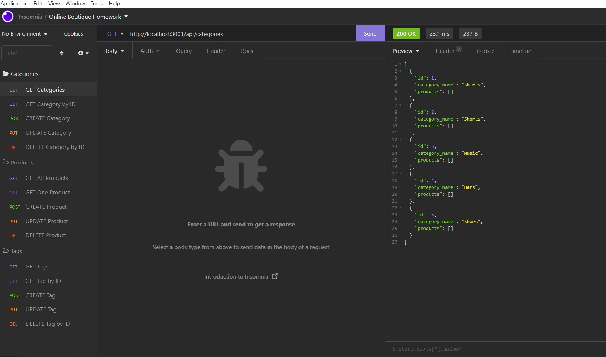

# online-boutique-back-end

# Description
  I built the back end for an e-commerce site by modifying starter code. I configured a working Express.js API to use Sequelize to interact with a MySQL database.

[link to GitHub repository](https://github.com/Ro-Galvan/company-employee-database)

[video demo -part 1](https://drive.google.com/file/d/1CjkbMLSsXomKh0J0M-JwLi4FBkwEFQuy/view)

[video demo -part 2](https://drive.google.com/file/d/1SgNUkeXrUg-Zm3wOfCM9FcmYfhHUVzLd/view)

# Table of Contents
  - [Installation](#installation)
  - [Usage](#usage)
  - [License](#license)
  - [Questions](#questions)

# Installation
  Install the below packages/modules from node.js by running `npm install` :
- sequelize 
- mysql2 
- express
- In the terminal run `mysql -u root` or `mysql -u root -p` (if you have a password) then enter `SOURCE db/schema.sql;` then `quit`
- To seed the database, from the terminal, `run npm seed` then `run npm watch`
- You can then go to Insomnia and set up your routes to test everything

# Usage

# License
 MIT

# Questions
  Link to my github:
  https://github.com/Ro-Galvan
 
  Contact me:
  https://www.linkedin.com/in/rocio-galvan/ 